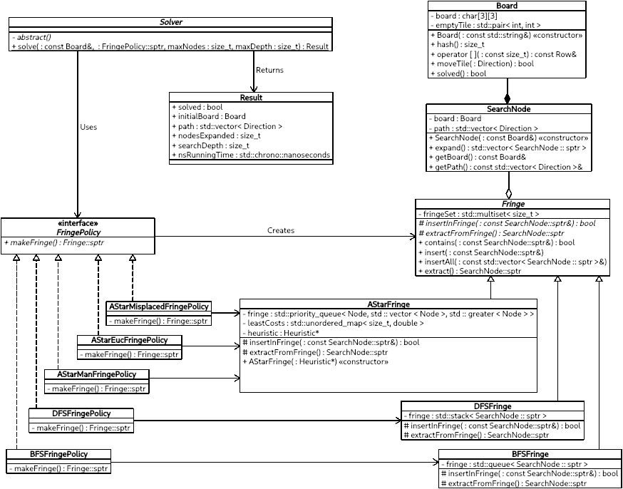

# AI 8-Puzzle Solver

Solves arbitrary 8-puzzle boards using a set of different algorithms, namely
BFS, DFS, and A\*, and reports some statistics for the solution.

## Class Diagram



## Quick start

```console
foo@bar:~$ git clone git@github.com:abdelhakeem/8puzzle.git
foo@bar:~$ cd 8puzzle
foo@bar:8puzzle$ mkdir build
foo@bar:8puzzle$ cmake -B build
foo@bar:8puzzle$ make -C build
foo@bar:8puzzle$ ./build/8puzzle

USAGE: 8puzzle [-a <algorithm>] [-n <nodes>] [-d <depth>] <board>

  <algorithm>

    bfs   Breadth-First Search
    dfs   Depth-First Search
    aman  A-Star Search using Manhattan distance heuristic
    aeuc  A-Star Search using Euclidean distance heuristic
    amis  A-Star Search using misplaced tiles count heuristic

  <nodes>      Maximum number of nodes to expand
  <depth>      Maximum search depth
  <board>      Initial board configuration (e.g.: 102345678)
```

## Sample Runs

```console
foo@bar:8puzzle$ ./build/8puzzle 120345678

Solution with A-Star Search using misplaced tiles count heuristic:

Search depth: 2
Nodes expanded: 3
Running time: 31183 ns
Path cost: 2

Solution with A-Star using Euclidean distance heuristic:

Search depth: 2
Nodes expanded: 3
Running time: 23247 ns
Path cost: 2

Solution with A-Star using Manhattan distance heuristic:

Search depth: 2
Nodes expanded: 3
Running time: 21674 ns
Path cost: 2

Solution with DFS:

Search depth: 2
Nodes expanded: 3
Running time: 15565 ns
Path cost: 2

Solution with BFS:

Search depth: 2
Nodes expanded: 7
Running time: 51035 ns
Path cost: 2

foo@bar:8puzzle$ ./build/8puzzle 312458670 -a bfs

Solution with BFS:

3 1 2
4 5 8
6 7

  |
  | Up
  |
  V

3 1 2
4 5
6 7 8

  |
  | Left
  |
  V

3 1 2
4   5
6 7 8

  |
  | Left
  |
  V

3 1 2
  4 5
6 7 8

  |
  | Up
  |
  V

  1 2
3 4 5
6 7 8

Search depth: 4
Nodes expanded: 22
Running time: 192206 ns
Path cost: 4

```
